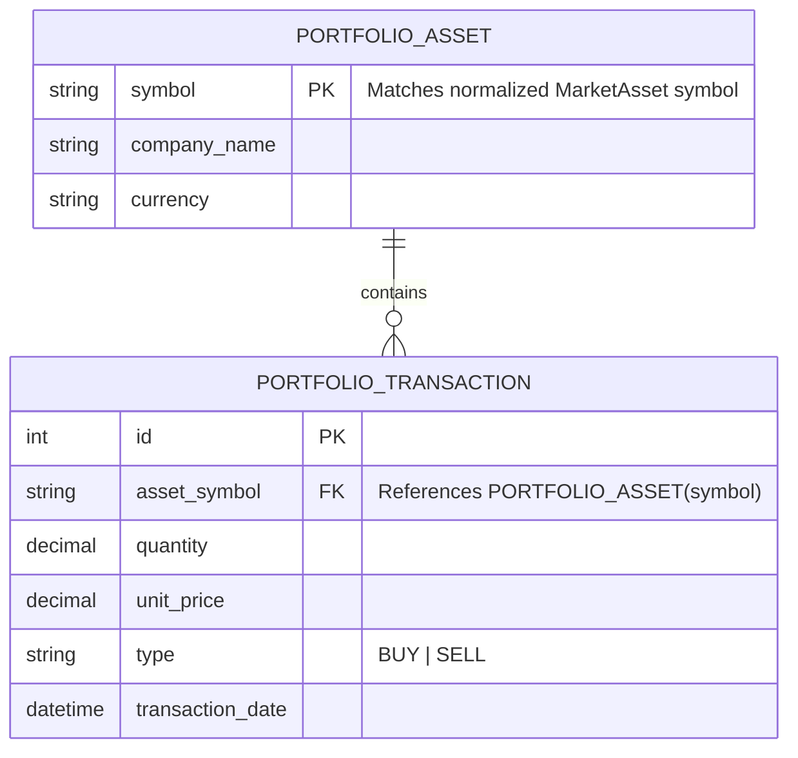

# Data Model Design: Asset Market Integration

**Feature**: Asset Market Integration  
**Date**: 2026-05-30  
**Status**: Approved

This document details the data contracts, models, and future persistence schema for the Asset Market Integration feature.

---

## 1. Backend Data Structures (NestJS)

### 1.1 Outgoing DTOs & Normalization Contracts

The NestJS backend normalizes responses from Brapi before delivering them to the mobile frontend.

#### MarketAssetDto (Search Results)
Representing a single searchable asset in a listing payload.
```typescript
class MarketAssetDto {
  symbol: string; // e.g., "PETR4"
  name: string;   // e.g., "Petroleo Brasileiro S.A. - Petrobras"
}
```

#### AssetDetailsDto (Detailed Information)
Representing the full market details of a selected asset.
```typescript
class AssetDetailsDto {
  symbol: string;        // e.g., "PETR4"
  name: string;          // e.g., "Petroleo Brasileiro S.A. - Petrobras"
  currentPrice: number;  // e.g., 38.50
  dayHigh: number;       // e.g., 39.10
  dayLow: number;        // e.g., 38.10
  changePercent: number; // e.g., 1.25 (positive or negative float)
  currency: string;      // e.g., "BRL"
  updatedAt: string;     // ISO 8601 string, e.g., "2026-05-30T10:30:00.000Z"
}
```

### 1.2 Incoming Query DTOs

#### SearchQueryDto
Validated via `class-validator`.
```typescript
import { IsString, MinLength } from 'class-validator';

export class SearchQueryDto {
  @IsString()
  @MinLength(1)
  query: string;
}
```

---

## 2. Frontend Data Models (Flutter/Dart)

Following Clean Architecture, we split the data mapping into a lightweight Domain Entity and a Data Model layer (JSON deserializer).

### 2.1 Domain Entities (`lib/features/assets/domain/entities/`)

#### MarketAsset Entity
```dart
class MarketAsset {
  final String symbol;
  final String name;

  const MarketAsset({
    required this.symbol,
    required this.name,
  });
}
```

#### AssetDetails Entity
```dart
class AssetDetails {
  final String symbol;
  final String name;
  final double currentPrice;
  final double dayHigh;
  final double dayLow;
  final double changePercent;
  final String currency;
  final DateTime updatedAt;

  const AssetDetails({
    required this.symbol,
    required this.name,
    required this.currentPrice,
    required this.dayHigh,
    required this.dayLow,
    required this.changePercent,
    required this.currency,
    required this.updatedAt,
  });
}
```

### 2.2 Data Models (`lib/features/assets/data/models/`)

Adds JSON factory constructors to deserialize payloads safely.

#### MarketAssetModel
```dart
import '../../domain/entities/market_asset.dart';

class MarketAssetModel extends MarketAsset {
  const MarketAssetModel({
    required super.symbol,
    required super.name,
  });

  factory MarketAssetModel.fromJson(Map<String, dynamic> json) {
    return MarketAssetModel(
      symbol: json['symbol'] as String? ?? '',
      name: json['name'] as String? ?? '',
    );
  }
}
```

#### AssetDetailsModel
```dart
import '../../domain/entities/asset_details.dart';

class AssetDetailsModel extends AssetDetails {
  const AssetDetailsModel({
    required super.symbol,
    required super.name,
    required super.currentPrice,
    required super.dayHigh,
    required super.dayLow,
    required super.changePercent,
    required super.currency,
    required super.updatedAt,
  });

  factory AssetDetailsModel.fromJson(Map<String, dynamic> json) {
    return AssetDetailsModel(
      symbol: json['symbol'] as String? ?? '',
      name: json['name'] as String? ?? '',
      currentPrice: (json['currentPrice'] as num?)?.toDouble() ?? 0.0,
      dayHigh: (json['dayHigh'] as num?)?.toDouble() ?? 0.0,
      dayLow: (json['dayLow'] as num?)?.toDouble() ?? 0.0,
      changePercent: (json['changePercent'] as num?)?.toDouble() ?? 0.0,
      currency: json['currency'] as String? ?? 'BRL',
      updatedAt: json['updatedAt'] != null 
          ? DateTime.parse(json['updatedAt'] as String) 
          : DateTime.now(),
    );
  }
}
```

---

## 3. Future Readiness: Portfolio Database Schema

To support future portfolio valuation features, we plan the following database schema (e.g. SQLite/PostgreSQL mapping) that integrates with this normalized model.



### 3.1 Valuation Math Foundation
- Current Valuation = $\sum (\text{Transaction Quantity} \times \text{Current Normalized Price from Brapi})$.
- This data model matches that valuation design because the backend consistently returns `currentPrice` as a standard decimal float, matching `unit_price` storage type.
