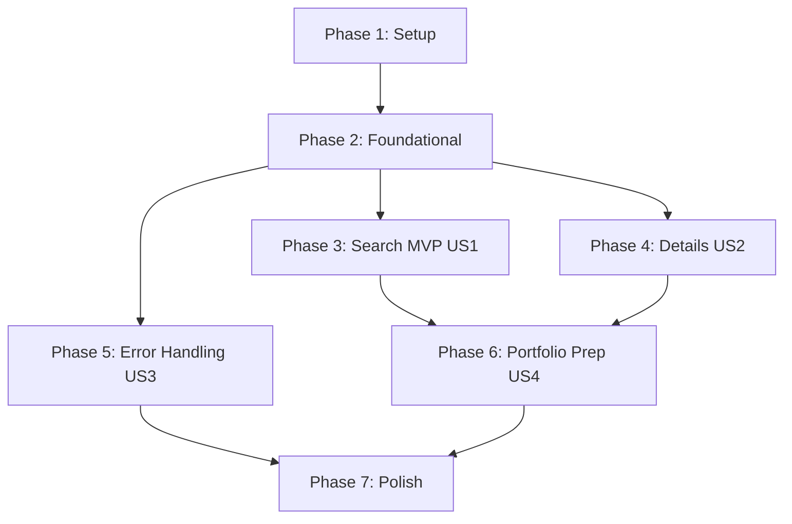

# Tasks: Asset Market Integration

**Input**: Design documents from `/specs/003-asset-market-integration/`
**Prerequisites**: plan.md, spec.md, research.md, data-model.md, contracts/assets.md

---

## Format: `[ID] [P?] [Story] Description`

- **[P]**: Can run in parallel (different files, no dependencies)
- **[Story]**: Which user story this task belongs to (US1, US2, US3, US4)
- Exact file paths are explicitly listed in descriptions.

---

## Phase 1: Setup (Shared Infrastructure)

**Purpose**: Project initialization and basic dependencies structure.

- [x] T001 Install NestJS HTTP Axios and Cache Manager dependencies in `backend/package.json`
- [x] T002 Install Flutter shimmer loading skeleton library in `investment_agenda/pubspec.yaml`
- [x] T003 [P] Configure backend environmental variable `BRAPI_API_TOKEN` in `backend/.env`

---

## Phase 2: Foundational (Blocking Prerequisites)

**Purpose**: Core gateway plumbing that MUST be completed before frontend/backend user story integration starts.

**⚠️ CRITICAL**: All subsequent user stories depend on this phase being completed.

- [x] T004 Setup basic `AssetsModule` and import `HttpModule` and `CacheModule` in `backend/src/modules/assets/assets.module.ts`
- [x] T005 Create standard `HttpExceptionFilter` to capture external Axios/Brapi exceptions and format standard payload errors in `backend/src/modules/assets/filters/http-exception.filter.ts`
- [x] T006 [P] Register `HttpExceptionFilter` globally or inside the assets module to map rate limits and timeouts to standardized JSON errors in `backend/src/modules/assets/assets.module.ts`

**Checkpoint**: Foundation ready - both backend proxy endpoints and frontend clean architecture implementation can proceed.

---

## Phase 3: User Story 1 - Search and Find Assets (Priority: P1) 🎯 MVP

**Goal**: Allow investors to search for Brazilian B3 market assets by their symbol or company name using a debounced typeahead, listing outcomes cleanly.

**Independent Test**: Entering search queries on the frontend lists matching symbols and names with shimmer loading skeletons, with no direct Brapi calls from the client device.

### Tests for User Story 1
> **NOTE: Write these tests FIRST, ensuring they FAIL before implementation**

- [x] T007 [P] [US1] Create backend unit tests verifying search query delegation and normalization in `backend/src/modules/assets/assets.service.spec.ts`
- [x] T008 [P] [US1] Create frontend unit tests verifying search model deserialization and query firing in `investment_agenda/test/features/assets/data/models/market_asset_model_test.dart`

### Implementation for User Story 1

- [x] T009 [P] [US1] Create inbound SearchQueryDto with class-validator validation and regex sanitization to block special characters in `backend/src/modules/assets/dto/search-query.dto.ts`
- [x] T010 [P] [US1] Create outgoing MarketAssetDto interface schema in `backend/src/modules/assets/dto/market-asset.dto.ts`
- [x] T011 [US1] Implement `AssetsService.search()` proxying search queries with namespaced caching (`assets:search:${query}`) and a Mock Fallback mode for missing API keys or remote outage in `backend/src/modules/assets/assets.service.ts`
- [x] T012 [US1] Implement `AssetsController.search()` endpoint mapping GET `/api/assets/search` in `backend/src/modules/assets/assets.controller.ts`
- [x] T013 [P] [US1] Create Flutter domain entities `MarketAsset` in `investment_agenda/lib/features/assets/domain/entities/market_asset.dart`
- [x] T014 [P] [US1] Define abstract `AssetsRepository` search contract in `investment_agenda/lib/features/assets/domain/repositories/assets_repository.dart`
- [x] T015 [P] [US1] Create Flutter `MarketAssetModel` mapping from JSON in `investment_agenda/lib/features/assets/data/models/market_asset_model.dart`
- [x] T016 [US1] Create `AssetsRemoteDataSource` to perform GET queries to the NestJS search endpoint in `investment_agenda/lib/features/assets/data/datasources/assets_remote_data_source.dart`
- [x] T017 [US1] Implement `AssetsRepositoryImpl` mapping search model arrays to entities in `investment_agenda/lib/features/assets/data/repositories/assets_repository_impl.dart`
- [x] T018 [US1] Implement `SearchAssetsUseCase` triggering repository calls in `investment_agenda/lib/features/assets/domain/usecases/search_assets_usecase.dart`
- [x] T019 [US1] Implement `AssetsProvider` state ChangeNotifier managing debounced search inputs in `investment_agenda/lib/features/assets/presentation/providers/assets_provider.dart`
- [x] T020 [US1] Implement responsive `AssetSearchPage` containing search input, list tiles, and skeletal shimmer placeholder items in `investment_agenda/lib/features/assets/presentation/pages/asset_search_page.dart`

**Checkpoint**: At this point, User Story 1 is fully functional and testable independently (MVP ready!).

---

## Phase 4: User Story 2 - View Detailed Asset Information (Priority: P1)

**Goal**: Allow users to select an asset from the search results and view a detailed view containing the current market price, daily high/low boundaries, price changes, and currency.

**Independent Test**: Selecting an asset pushes the details view with shimmer placeholders, loading normalized numeric values, currencies, and timestamps from the backend.

### Tests for User Story 2

- [x] T021 [P] [US2] Create backend unit tests verifying detailed asset quote fetches and caching in `backend/src/modules/assets/assets.service.spec.ts`
- [x] T022 [P] [US2] Create frontend unit tests verifying detailed model parsing and datetime parsing in `investment_agenda/test/features/assets/data/models/asset_details_model_test.dart`

### Implementation for User Story 2

- [x] T023 [P] [US2] Create outgoing normalized AssetDetailsDto schema in `backend/src/modules/assets/dto/asset-details.dto.ts`
- [x] T024 [US2] Implement `AssetsService.getDetails()` proxying detailed quote fetches with namespaced caching (`assets:details:${ticker}`) and a Mock Fallback mode in `backend/src/modules/assets/assets.service.ts`
- [x] T025 [US2] Implement `AssetsController.getDetails()` mapping GET `/api/assets/details/:ticker` in `backend/src/modules/assets/assets.controller.ts`
- [x] T026 [P] [US2] Create Flutter domain entities `AssetDetails` in `investment_agenda/lib/features/assets/domain/entities/asset_details.dart`
- [x] T027 [P] [US2] Create Flutter `AssetDetailsModel` mapping detailed stock quotes from JSON in `investment_agenda/lib/features/assets/data/models/asset_details_model.dart`
- [x] T028 [US2] Extend `AssetsRemoteDataSource` and `AssetsRepositoryImpl` to query details and return entities in `investment_agenda/lib/features/assets/`
- [x] T029 [US2] Implement `GetAssetDetailsUseCase` triggering repository details calls in `investment_agenda/lib/features/assets/domain/usecases/get_asset_details_usecase.dart`
- [x] T030 [US2] Extend `AssetsProvider` state to fetch and hold the active selected asset's details in `investment_agenda/lib/features/assets/presentation/providers/assets_provider.dart`
- [x] T031 [US2] Create responsive `AssetDetailsPage` presenting current price, high/low boundaries, change percentages, and shimmer skeleton loading in `investment_agenda/lib/features/assets/presentation/pages/asset_details_page.dart`

**Checkpoint**: At this point, User Stories 1 AND 2 are both fully functional and testable independently.

---

## Phase 5: User Story 3 - Graceful Handling of External API Failures (Priority: P2)

**Goal**: Handle rate limits (429) and outages (503) from the external provider gracefully, converting them into standard client error JSONs and displaying localized retry states.

**Independent Test**: Simulating an HTTP 429/503 from backend returns a standardized retryable error payload, and frontend displays an error banner with a clickable "Retry" button.

### Tests for User Story 3

- [x] T032 [P] [US3] Create backend unit tests verifying exception filter response properties in `backend/src/modules/assets/filters/http-exception.filter.spec.ts`
- [x] T033 [P] [US3] Create frontend widget tests verifying warning cards and retry interaction in `investment_agenda/test/features/assets/presentation/pages/asset_search_page_test.dart`

### Implementation for User Story 3

- [x] T034 [US3] Refine backend `HttpExceptionFilter` to intercept Axios rate limits and network outages, returning `retryable: true` payload in `backend/src/modules/assets/filters/http-exception.filter.ts`
- [x] T035 [US3] Extend Flutter data layer to parse custom `retryable` and `message` strings on HTTP error states in `investment_agenda/lib/features/assets/data/datasources/assets_remote_data_source.dart`
- [x] T036 [US3] Extend `AssetsProvider` to capture error models and expose retry action triggers to the UI in `investment_agenda/lib/features/assets/presentation/providers/assets_provider.dart`
- [x] T037 [US3] Add localized warning widgets and retry triggers to both `AssetSearchPage` and `AssetDetailsPage` in `investment_agenda/lib/features/assets/presentation/`

**Checkpoint**: Error handling is completely integrated; transient API glitches recover cleanly with retry actions.

---

## Phase 6: User Story 4 - Portfolio Integration Foundation (Priority: P3)

**Goal**: Validate normalized data fields match database primary/foreign keys to support seamless portfolio linkups.

**Independent Test**: All entities and model fields are verified to use clean symbol tickers, uniform decimals, BRL currencies, and ISO timestamps.

- [x] T038 [US4] Perform validation check on data models to ensure they support persistent portfolio asset relations in `investment_agenda/lib/features/assets/domain/entities/`

---

## Phase 7: Polish & Cross-Cutting Concerns

**Purpose**: General integration and cross-cutting details.

- [x] T039 Add new routes to the navigation layout or GoRouter setup in `investment_agenda/lib/core/routing/`
- [x] T040 Perform complete verification check as described in `quickstart.md`

---

## Dependencies & Execution Order

### Phase Dependencies



- **Setup (Phase 1)**: Can start immediately.
- **Foundational (Phase 2)**: Depends on Setup completion. Blocks frontend-backend integration.
- **User Stories (Phases 3, 4, 5)**: Depends on Foundational completion.
  - Can proceed in parallel or sequentially.
- **Portfolio Prep (Phase 6)**: Depends on US1 & US2 completion.
- **Polish (Phase 7)**: Depends on all user stories being complete.

### Parallel Opportunities
- Setup tasks (T001, T002, T003) can be initialized in parallel.
- Foundational tasks (T005, T006) can run in parallel.
- Once Foundation completes, US1 and US2 backend endpoints can be implemented in parallel.
- Frontend models, repository contracts, and domain entities can be written in parallel.

---

## Parallel Example: User Story 1

```bash
# Launch models and repository interface setup together:
Task: "T013 [P] [US1] Create Flutter domain entities"
Task: "T014 [P] [US1] Define abstract repository search contract"
Task: "T015 [P] [US1] Create Flutter MarketAssetModel mapping"
```

---

## Implementation Strategy

### MVP First (User Story 1 Only)
1. Complete Setup (Phase 1)
2. Complete Foundational proxy setup (Phase 2)
3. Implement US1 search (Phase 3)
4. **STOP and VALIDATE**: Verify debounced search returns results on the Flutter frontend.
