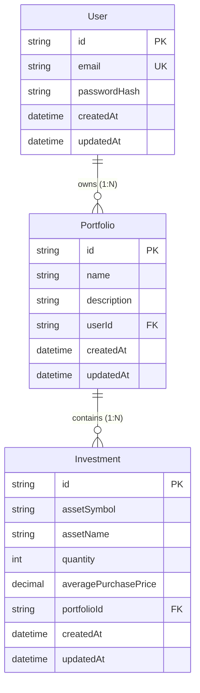

# Relational Data Models & Database Schema

This document defines the relational models and the corresponding Prisma schema for PostgreSQL.

## 1. Entity Diagram (Logical View)



---

## 2. Prisma Database Schema (`schema.prisma`)

This file will be located at `backend/prisma/schema.prisma`.

```prisma
datasource db {
  provider = "postgresql"
  url      = env("DATABASE_URL")
}

generator client {
  provider = "prisma-client-js"
}

model User {
  id           String      @id @default(uuid())
  email        String      @unique
  passwordHash String
  createdAt    DateTime    @default(now())
  updatedAt    DateTime    @updatedAt
  portfolios   Portfolio[]

  @@map("users")
}

model Portfolio {
  id          String       @id @default(uuid())
  name        String
  description String?
  userId      String
  user        User         @relation(fields: [userId], references: [id], onDelete: Cascade)
  investments Investment[]
  createdAt   DateTime     @default(now())
  updatedAt   DateTime     @updatedAt

  @@unique([userId, name])
  @@index([userId])
  @@map("portfolios")
}

model Investment {
  id                   String    @id @default(uuid())
  assetSymbol          String
  assetName            String
  quantity             Int
  averagePurchasePrice Decimal   @db.Decimal(12, 2)
  portfolioId          String
  portfolio            Portfolio @relation(fields: [portfolioId], references: [id], onDelete: Cascade)
  createdAt            DateTime  @default(now())
  updatedAt            DateTime  @updatedAt

  @@index([portfolioId])
  @@map("investments")
}
```

---

## 3. Relational & Business Integrity Constraints

### Cascading Rules
- `User` deletion triggers deletion of all owned `Portfolio` records.
- `Portfolio` deletion triggers deletion of all associated `Investment` transactions.
- These rules are enforced directly in the database level via Postgres `ON DELETE CASCADE` constraints generated by Prisma.

### Uniqueness and Indexes
- **Portfolio Uniqueness**: The combination of `userId` and `name` is unique (`@@unique([userId, name])`). A user cannot create two portfolios with the same name.
- **Indexes**: Database indexes are defined on foreign keys (`userId` in portfolios, `portfolioId` in investments) to ensure rapid query joins when pulling dashboards and lists.
